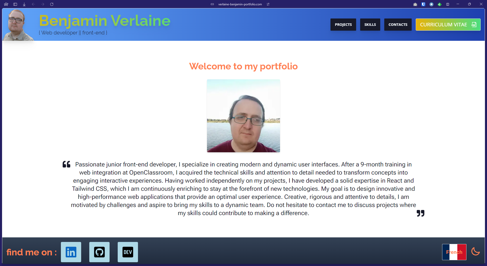

# projet-12-formation-openclassroom

## Présentation

Projet 12 de ma formation d'intégrateur web sur OpenClassroom, qui a pour but de créer mon portfolio. Ce projet me permettra de présenter mes compétences, mes réalisations et mes projets personnels dans le domaine du développement web.

## Objectifs

-   Mettre en avant mes compétences en HTML, CSS, TailwindCSS, JavaScript et React.
-   Créer une interface utilisateur responsive et esthétique.
-   Intégrer des projets réalisés durant ma formation et mes expériences personnelles.
-   Offrir une navigation fluide et intuitive pour les visiteurs.

## Technologies utilisées

-   **Vite.js** : Outil de développement front-end
-   **JavaScript** : Interactivité et dynamisme.
-   **React-icons** : Collection complète d'icone.
-   **Tailwind CSS** (si utilisé) : Framework CSS pour un design rapide et responsive.
-   **React** : Bibliothèque JavaScript pour construire des interfaces utilisateur.
-   **React Router** : Gestion de la navigation entre les différentes pages de l'application.
-   **React-i18next** : Utiliser pour changer la langue du site web.
-   **Emailjs** : Gestion d'envoie d'email.

# Projet 12 - Formation OpenClassroom : Mon Portfolio

## Présentation

Le **projet 12** de ma formation d'intégrateur web sur OpenClassroom a pour but de créer mon portfolio. Ce projet me permet de mettre en avant mes compétences en développement web, mes réalisations et mes projets personnels.



## Objectifs

-   Mettre en avant mes compétences en **HTML**, **CSS**, **TailwindCSS**, **JavaScript** et **React**.
-   Créer une interface utilisateur **responsive** et **esthétique**.
-   Intégrer mes projets réalisés durant ma formation et mes expériences personnelles.
-   Offrir une **navigation fluide** et **intuitive** pour les visiteurs.

## Technologies utilisées

-   **Vite.js** : Outil de développement front-end ultra rapide.
-   **JavaScript** : Langage pour ajouter de l'interactivité et du dynamisme.
-   **React** : Bibliothèque JavaScript pour construire des interfaces utilisateur modulaires.
-   **React Router** : Gestion de la navigation entre les différentes pages de l'application.
-   **Tailwind CSS** : Framework CSS utilitaire pour un design rapide et responsive.
-   **React-icons** : Collection complète d'icônes SVG personnalisables.
-   **React-i18next** : Gestion de la traduction et du changement de langue.
-   **EmailJS** : Service d'envoi d'e-mails depuis le site web.

## Fonctionnalités

-   **Navigation fluide** : Utilisation de `React Router` pour naviguer facilement entre les différentes sections du portfolio.
-   **Support multilingue** : Changement dynamique de langue grâce à `react-i18next`.
-   **Formulaire de contact** : Envoi d'e-mails via **EmailJS** pour recevoir des messages directement sur mon adresse email.

## Installation

Suivez ces étapes pour installer et exécuter le projet localement :

1. **Clonez le dépôt GitHub** :
    ```bash
    git clone https://github.com/votre-nom-utilisateur/projet-12-formation-openclassroom.git
    ```

## Installation

Pour visualiser le projet localement, suivez ces étapes :

1. Clonez le dépôt :
    ```bash
    git clone https://github.com/votre-nom-utilisateur/projet-12-formation-openclassroom.git
    ```
